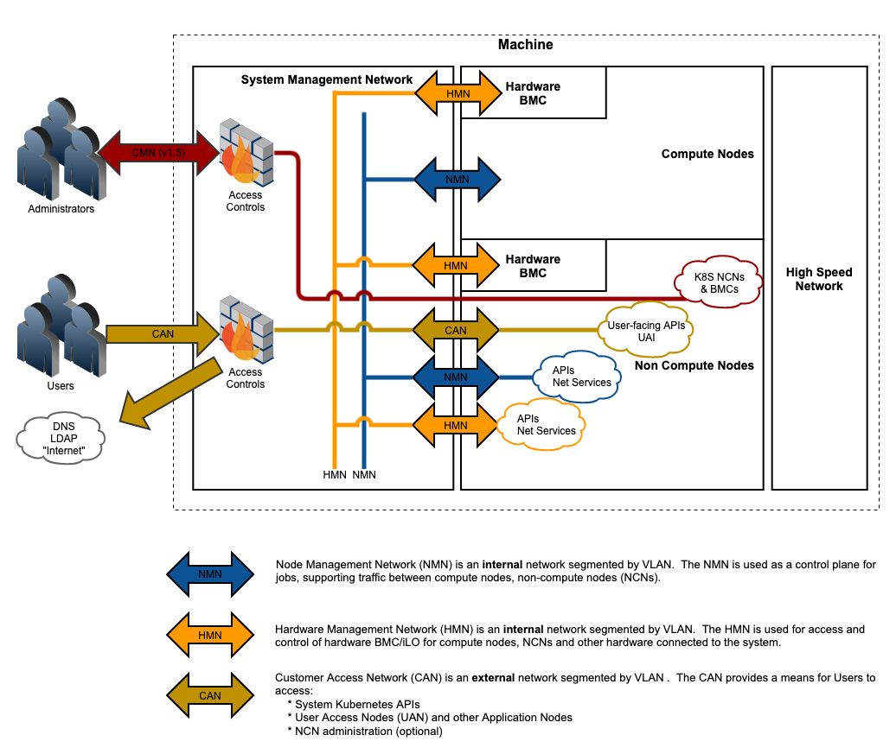

<nav class="toc-fixed" markdown="1">
* TOC
{:toc}
</nav>

This document describes the site information customers must have
available before beginning an installation of CSM as part of Shasta
v1.4.

These instructions are only valid for the Shasta v1.4 release with CSM
\>=0.8.0 and CSI \>=1.5.0

The CSM questionnaire outlines information needed to seed an
installation of CSM.  Also included is an abridged overview of Shasta to
help new customers understand the context of this configuration.

# Glossary

<table>
<colgroup>
<col style="width: 12%" />
<col style="width: 87%" />
</colgroup>
<thead>
<tr class="header">
<th><strong>Term</strong></th>
<th><strong>Description</strong></th>
</tr>
</thead>
<tbody>
<tr class="odd">
<td>CSM</td>
<td>Cray System Management describes the software and hardware associated with managing a Shasta supercomputer.  It includes, but is not limited to, Non-Compute Nodes (NCNs), Kubernetes, Ceph, management network architecture and an array of microservices that provide core management functionality.</td>
</tr>
<tr class="even">
<td>PIT</td>
<td>
Pre-Install Toolkit

The CSM installer in Shasta v1.4 runs from a LiveCD that boots into a short-lived installation environment.  This environment is called the "Pre-Install Toolkit", or "PIT".

After the PIT has been used to boot the NCN servers, start Kubernetes, and deploy the CSM micro-services, the server running the PIT is rebooted with a new image using the CSM micro-services.  The end result is that there are no special or unique NCNs in Shasta v1.4.

The PIT replaces the BIS node found in previous versions of Shasta.
</td>
</tr>
<tr class="odd">
<td>NMN</td>
<td>
Node Management Network

The subnet/VLAN that is purely internal to the system and is shared by all nodes in the system. It is used for management traffic, but not communication with hardware like BMCs.
</td>
</tr>
<tr class="even">
<td>HMN</td>
<td>
Hardware Management Network

The subnet/VLAN that is associated with the Baseboard Management Controllers (BMCs) on servers, switches, and other hardware controllers in Shasta.  This network is used for power control and firmware upgrades and is internal to the system.
</td>
</tr>
<tr class="odd">
<td>CAN</td>
<td>
Customer Access Network

A subnet/VLAN that is configured to connect site users to user-facing APIs running on the system NCNs.  The CAN is also used for system access to site resources like LDAP, NTP, and DNS.

The CAN uses site-routable CIDR block.  A configuration without CAN is possible, air-gap systems for instance, but limits some functionality of systems management. The CIDR block is configurable at install time.
</td>
</tr>
<tr class="even">
<td>HSN</td>
<td>
High Speed Network

The low-latency 100Gb+ ethernet network used for MPI workloads and data transfer between the CNs. It is also connected to some of the NCNs for management and data transfer services.
</td>
</tr>
<tr class="odd">
<td>CN</td>
<td>
Compute Node

A compute node is a server that has been configured to run jobs from a workload manager.  Compute nodes are managed by CSM over the NMN.
</td>
</tr>
<tr class="even">
<td>UAN</td>
<td>
User Access Node

A User Access Node is a server to which users connect to develop and compile jobs.  UANs are often connected directly to a site switch, making them accessible to end users.
</td>
</tr>
<tr class="odd">
<td>AN</td>
<td>
Application Node

An AN is any server that runs a custom application.  ANs are very similar to UANs but typically without a CAN.
</td>
</tr>
<tr class="even">
<td>NCN</td>
<td>
Non-Compute Nodes

NCNs are most commonly manager, worker, or storage nodes that run as part of the Kubernetes cluster (more on these below), but can also refer to any other server that is not a compute node (CN).

Other types of NCNs include User Access Nodes (UANs) and Application Nodes (ANs).
</td>
</tr>
<tr class="odd">
<td>Worker Node</td>
<td>Worker nodes are NCNs that are configured as Kubernetes workers.  Kubernetes workers run container-based workloads such as the micro-services that are used to interact with Shasta.</td>
</tr>
<tr class="even">
<td>Manager Node</td>
<td>Manager nodes are NCNs that are configured as Kubernetes managers.  Kubernetes managers run the Kubernetes APIs and services that manage Kubernetes.</td>
</tr>
<tr class="odd">
<td>Storage Node</td>
<td>Storage nodes are NCNs that are configured to run Ceph and provide block-based IP storage for CSM.</td>
</tr>
</tbody>
</table>

# Shasta Overview

The diagram below is an abstract view into how a Shasta environment is
structured.

The Customer Management Network (CMN) does not exist in Shasta v1.4.  It
will be added in Shasta 1.5 as a dedicated subnet for administrative
access.

<table>
<colgroup>
<col style="width: 100%" />
</colgroup>
<thead>
<tr class="header">
<th><table>
<colgroup>
<col style="width: 100%" />
</colgroup>
<thead>
<tr class="header">
<th></th>
</tr>
</thead>
<tbody>
</tbody>
</table></th>
</tr>
</thead>
<tbody>
</tbody>
</table>

### Certificate Naming Warning

The combination of --system-name and --site-domain are used to generate
a set of certificates that form the basis of TLS security across CSM.
Post-Install adjustments of these values in Shasta 1.4 is not supported.

### System Name

<table style="width:100%;">
<colgroup>
<col style="width: 29%" />
<col style="width: 32%" />
<col style="width: 14%" />
<col style="width: 23%" />
</colgroup>
<thead>
<tr class="header">
<th><strong>System Name</strong></th>
<th><strong>--system-name</strong></th>
<th><strong>string</strong></th>
<th><strong>"sn-2024"</strong></th>
</tr>
</thead>
<tbody>
</tbody>
</table>

The name of the system.  This value is prepended to the "Site Domain" to
create the FQDN for the system.  This parameter impacts the Subject Name
of some certificates and cannot be easily changed after CSM has been
installed.

### Site Domain

<table>
<colgroup>
<col style="width: 24%" />
<col style="width: 30%" />
<col style="width: 13%" />
<col style="width: 31%" />
</colgroup>
<thead>
<tr class="header">
<th><strong>Site Domain</strong></th>
<th><strong>--site-domain</strong></th>
<th><strong>string</strong></th>
<th><strong>"<a href="http://dev.cray.com/">dev.cray.com</a>"</strong></th>
</tr>
</thead>
<tbody>
</tbody>
</table>

The site domain to be used in the FQDN.  This corresponds to the site
DNS zone that will be associated with the Shasta system being
installed.  Site domain selection is also critical in creation of system
certificates certificates during installation.  Changing these
certificates post-installation is not a supported activity.

## Customer Access Network IP Addresses

The Customer Access Network is a set of site-provided ip addresses that
CSM uses to grant access to services. CSM manages these IP addresses and
provides name resolution to services within the CAN. Some services,
namely DNS services, can be specified ahead of time so that site DNS
servers can be configured with an upstream IP address for the zone, even
before the system arrives on site. Keep in mind that site networking
will need to route these IP addresses according to the diagram above .
There are a set of ip addresses on the CAN that will be static and
therefore, once set by the application, user intervention is needed to
change them. The DNS Server is an example of a static reservation. CSM
developers strive to keep the number of ip addresses needed in the
static pool to a minimum while using the dynamic pool for most services.
IP addresses within the CAN CIDR, but outside the two named pools are
used for direct host ip addresses where necessary.

Both pools are used by CSM to provide resilient, load-balanced access to
all services via a software load balancer called
[MetalLB](https://metallb.universe.tf/).

### CAN CIDR Block

<table>
<colgroup>
<col style="width: 29%" />
<col style="width: 19%" />
<col style="width: 23%" />
<col style="width: 27%" />
</colgroup>
<thead>
<tr class="header">
<th><strong>CAN CIDR Block</strong></th>
<th><strong>--can-cidr</strong></th>
<th><strong>string (CIDR)</strong></th>
<th><strong>"10.102.11.0/24"</strong></th>
</tr>
</thead>
<tbody>
</tbody>
</table>

A CIDR block that defines a site-routable IP range that is allocated to
the CAN.  Shasta will assign IPs within the CIDR block to endpoints that
are connected to the CAN.  Systems without the CAN, air-gap for
instance, still need to define the CAN gateway, CAN CIDR block, as well
as CAN static and dynamic pools, but the network need not transit
outside the system.

### CAN Gateway

<table>
<colgroup>
<col style="width: 27%" />
<col style="width: 28%" />
<col style="width: 20%" />
<col style="width: 24%" />
</colgroup>
<thead>
<tr class="header">
<th><strong>CAN Gateway</strong></th>
<th><strong>--can-gateway</strong></th>
<th><strong>string (IP)</strong></th>
<th><strong>&lt;no default&gt;</strong></th>
</tr>
</thead>
<tbody>
</tbody>
</table>

The CAN uses a site-routable CIDR block.  The CAN Gateway parameter is
used to configure which IP should be used as the gateway for the CAN
routes.

> example: 10.103.2.1

### CAN Dynamic Pool

<table style="width:100%;">
<colgroup>
<col style="width: 26%" />
<col style="width: 28%" />
<col style="width: 19%" />
<col style="width: 25%" />
</colgroup>
<thead>
<tr class="header">
<th><strong>CAN Dynamic Pool</strong></th>
<th><strong>--can-dynamic-pool</strong></th>
<th><strong>string (CIDR)</strong></th>
<th><strong>"10.102.11.128/25"</strong></th>
</tr>
</thead>
<tbody>
</tbody>
</table>

A CIDR block that defines a site IP range that is set aside for load
balanced services that may be dynamically allocated.  This is used for
ephemeral services like UAIs that request a dynamic IP on boot.  This
CIDR block must be a subset of "CAN CIDR Block".

### CAN Static Pool

<table>
<colgroup>
<col style="width: 23%" />
<col style="width: 28%" />
<col style="width: 20%" />
<col style="width: 27%" />
</colgroup>
<thead>
<tr class="header">
<th><strong>CAN Static Pool</strong></th>
<th><strong>--can-static-pool</strong></th>
<th><strong>string (CIDR)</strong></th>
<th><strong>"10.102.11.112/28"</strong></th>
</tr>
</thead>
<tbody>
</tbody>
</table>

A CIDR block that defines a site IP range that is set aside for load
balanced services that must be statically defined rather than
dynamically allocated.  This CIDR block must be a subset of "CAN CIDR
Block".

### CAN External DNS

<table>
<colgroup>
<col style="width: 30%" />
<col style="width: 32%" />
<col style="width: 16%" />
<col style="width: 20%" />
</colgroup>
<thead>
<tr class="header">
<th><strong>CAN External DNS</strong></th>
<th><strong>--can-external-dns</strong></th>
<th><strong>string (IP)</strong></th>
<th><strong>&lt;no default&gt;</strong></th>
</tr>
</thead>
<tbody>
</tbody>
</table>

The CAN IP address to reserved for the CSM DNS endpoint which must be
part of the CAN Static Pool.  This is generally referred to as the
site-to-system lookup target.  The DNS zone \<sytem-name>.\<site-domain>
will be served by a DNS server at this IP address.

## Site Parameters

The following parameters are related to the site and generally should
match the expected values for the production environment except where
specifically noted below.

### NTP Pool

<table>
<colgroup>
<col style="width: 23%" />
<col style="width: 27%" />
<col style="width: 15%" />
<col style="width: 34%" />
</colgroup>
<thead>
<tr class="header">
<th><strong>NTP Pool</strong></th>
<th><strong>--ntp-pool</strong></th>
<th><strong>string</strong></th>
<th><strong>"time.nist.gov"</strong></th>
</tr>
</thead>
<tbody>
</tbody>
</table>

The site time server that will be used to synchronize the clocks on
the NCNs.  This setting is expected to be a DNS alias for an NTP pool
which will be expanded through the NTP protocol.  The NCNs are
configured to sync time with each other and operate as a stratum for
other nodes in Shasta that do not have a site connection but still need
to synchronize their clocks.

### PIT DNS Resolvers

<table>
<colgroup>
<col style="width: 31%" />
<col style="width: 30%" />
<col style="width: 11%" />
<col style="width: 27%" />
</colgroup>
<thead>
<tr class="header">
<th><strong>PIT DNS Resolvers</strong></th>
<th><strong>--ipv4-resolvers</strong></th>
<th><strong>string</strong></th>
<th><strong>"8.8.8.8, 9.9.9.9"</strong></th>
</tr>
</thead>
<tbody>
</tbody>
</table>

The site DNS resolvers that are used by the PIT as part of the
installation to resolve site services and upstream internet addresses
(where applicable).  This setting is generally the same as --site-dns,
but remains a separate configuration item to support installation in a
network that is different than the final production network.

### Site IP

<table>
<colgroup>
<col style="width: 26%" />
<col style="width: 21%" />
<col style="width: 27%" />
<col style="width: 25%" />
</colgroup>
<thead>
<tr class="header">
<th><strong>Site IP String</strong></th>
<th><strong>--site-ip</strong></th>
<th><strong>string (CIDR)</strong></th>
<th><strong>&lt;no default&gt;</strong></th>
</tr>
</thead>
<tbody>
</tbody>
</table>

The site IP/PREFIXLEN that will be used to by the PIT for initial setup
before the CAN is configured

You will use this connection to SSH into the PIT once it has booted.

> example: 10.103.15.194/30

### Site Gateway

<table>
<colgroup>
<col style="width: 27%" />
<col style="width: 22%" />
<col style="width: 22%" />
<col style="width: 26%" />
</colgroup>
<thead>
<tr class="header">
<th><strong>Site Gateway</strong></th>
<th><strong>--site-gw</strong></th>
<th><strong>string (IP)</strong></th>
<th><strong>&lt;no default&gt;</strong></th>
</tr>
</thead>
<tbody>
</tbody>
</table>

The IP of the site gateway to be used with the Site IP for routing
during installation and recovery operations.

> example: 10.103.15.193

### Site DNS

<table>
<colgroup>
<col style="width: 21%" />
<col style="width: 26%" />
<col style="width: 23%" />
<col style="width: 28%" />
</colgroup>
<thead>
<tr class="header">
<th><strong>Site DNS</strong></th>
<th><strong>--site-dns</strong></th>
<th><strong>string (IP)</strong></th>
<th><strong>&lt;no default&gt;</strong></th>
</tr>
</thead>
<tbody>
</tbody>
</table>

The IP of the site DNS server(s) that Shasta should forward to via the
Site IP.  This is usually the same as --ipv4-resolvers when
installations are performed within the final production network.

> example: 8.8.8.8, 9.9.9.9

### Bootstrap NCN BMC User

<table>
<colgroup>
<col style="width: 35%" />
<col style="width: 37%" />
<col style="width: 9%" />
<col style="width: 17%" />
</colgroup>
<thead>
<tr class="header">
<th><strong>Bootstrap NCN BMC User</strong></th>
<th><strong>--bootstrap-ncn-bmc-user</strong></th>
<th><strong>string</strong></th>
<th><strong>&lt;no default&gt;</strong></th>
</tr>
</thead>
<tbody>
</tbody>
</table>

The username that should be used when authenticating to the NCN BMCs. 
This should be set to the username provided by manufacturing.  Changing
BMC credentials is not safe during an install, but is supported through
HSM APIs in admin guide.

### Bootstrap NCN BMC Password

<table>
<colgroup>
<col style="width: 39%" />
<col style="width: 35%" />
<col style="width: 8%" />
<col style="width: 16%" />
</colgroup>
<thead>
<tr class="header">
<th><strong>Bootstrap NCN BMC Password</strong></th>
<th><strong>--bootstrap-ncn-bmc-pass</strong></th>
<th><strong>string</strong></th>
<th><strong>&lt;no default&gt;</strong></th>
</tr>
</thead>
<tbody>
</tbody>
</table>

The password that should be used when authenticating to the NCN BMCs.
This should be set to the password provided by manufacturing.  Changing
BMC credentials is not safe during an install, but is supported through
HSM APIs in admin guide.

### NCN Metadata

<table>
<colgroup>
<col style="width: 37%" />
<col style="width: 25%" />
<col style="width: 10%" />
<col style="width: 27%" />
</colgroup>
<thead>
<tr class="header">
<th><strong>NCN Metadata CSV File</strong></th>
<th><strong>--ncn-metadata</strong></th>
<th><strong>string</strong></th>
<th><strong>ncn_metadata.csv</strong></th>
</tr>
</thead>
<tbody>
</tbody>
</table>

The NCN Metadata CSV file will be needed before running csi.  It maps
the MACs of the Management NCNs to their xnames and is used to
initialize the management cluster.  If manufacturing has not provided
one for your system, it is possible to generate your own by following
the directions below. The following information is required to build up
the ncn_metadata.csv file:

-   NCN XName
-   HSM Role
    -   Allowed values: Management
-   HSM Subrole  
    -   Allowed values: Master, Worker, Storage
-   BMC MAC Address
-   MAC address that make up the Bond0

For additional information on constructing the `ncn_metadata.csv` file
please refer to the following pages in the CSM v1.4 documentation:

-   [301-NCN-METADATA-BMC](#)
-   [302-NCN-METADATA-BONDX](#)

### Switch Metadata

<table>
<colgroup>
<col style="width: 35%" />
<col style="width: 27%" />
<col style="width: 9%" />
<col style="width: 28%" />
</colgroup>
<thead>
<tr class="header">
<th><strong>Switch Metadata CSV File</strong></th>
<th><strong>--switch-metadata</strong></th>
<th><strong>string</strong></th>
<th><strong>switch_metadata.csv</strong></th>
</tr>
</thead>
<tbody>
</tbody>
</table>

CSV for mapping the switch xname, brand, type, and model for the
management switches in the system.The following types of management
switches should be included in this file:

-   Aggregation
-   Spine
-   Leaf
-   CDU

For additional information on constructing the switch_metadata.csv file
please refer
to [305-SWITCH-METADATA](#)
in the CSM v1.4 documentation.

### HMN Connections

<table>
<colgroup>
<col style="width: 37%" />
<col style="width: 25%" />
<col style="width: 8%" />
<col style="width: 28%" />
</colgroup>
<thead>
<tr class="header">
<th><strong>HMN Connections JSON File</strong></th>
<th><strong>--hmn-connections</strong></th>
<th><strong>string</strong></th>
<th><strong>hmn_connections.json</strong></th>
</tr>
</thead>
<tbody>
</tbody>
</table>

The hmn_connections.json file describes how the River HMN network is
cabled. Specifically, which switch ports on the Leaf switches are cabled
to what the River node BMCs, PDUs, or other hardware. This information
is sourced from the "HMN" tab from the systems SHCD.

For additional information on constructing the hmn_connections.json file
from the systems SHCD please refer
to [307-HMN-CONNECTIONS](#)
in the CSM v1.4 documentation.

## Optional Parameters

### Application Node Config

<table>
<colgroup>
<col style="width: 39%" />
<col style="width: 37%" />
<col style="width: 8%" />
<col style="width: 15%" />
</colgroup>
<thead>
<tr class="header">
<th><strong>Application Node Config YAML File</strong></th>
<th><strong>--application-node-config-yaml</strong></th>
<th><strong>string</strong></th>
<th><strong>&lt;no default&gt;</strong></th>
</tr>
</thead>
<tbody>
</tbody>
</table>

For additional control of the application node identification during the
SLS Input File generation, an additional config file is necessary and
must be indicated with the --application-node-config-yaml flag. Allows
for the control of the following within the generated SLS Input File:

1.  System specific prefix for Applications Nodes. 
2.  Specify HSM Subroles for system specific application nodes
3.  Specify Application Node Aliases

**It is recommended** to pre-specify the Application node alias using
this file, otherwise they will need to be manually added after CSM is
installed using
the [306-SLS-ADD-UAN-ALIAS](#)
procedure in the CSM documentation.

For additional information on constructing the
appplication_node_config.yaml file please refer
to [308-APPLICATION-NODE-CONFIG](#)
in the CSM v1.4 documentation. 

### Cabinet Configuration

<table>
<colgroup>
<col style="width: 35%" />
<col style="width: 30%" />
<col style="width: 11%" />
<col style="width: 22%" />
</colgroup>
<thead>
<tr class="header">
<th><strong>Cabinets YAML File</strong></th>
<th><strong>--cabinets-yaml</strong></th>
<th><strong>string</strong></th>
<th><strong>&lt;no default&gt;</strong></th>
</tr>
</thead>
<tbody>
</tbody>
</table>

For systems that use non-sequential cabinet id numbers, an additional
mapping file is necessary and must be indicated with the --cabinets-yaml
flag. 

For systems with Mountain or Hill cabinets, this configuration file can
be used to specify the NMN and HMN VLANs for the cabinets. On a Mountain
or Hill cabinet the CEC controls the VLAN settings for the NMN and HMN
networks on the cabinet.

For additional information on construction the cabinets.yaml file please
refer
to [310-CABINETS](#)
in the CSM v1.4 documentation. 

# Additional Information to Prepare

Beyond the inputs for cray-site-init that prepare the installation,
there are other pieces of data to have ready as part of the site
survey.  These items are used in the installation steps to install and
configure services and there are instructions in the admin guide for
changing them on-site.

# Changing information after an install is completed

Most of the information on this page can be adjusted after installation
with appropriate procedures and APIs.  The one major exception is the
machine name and site domain because they are part of the certificate
chain for so many other things.  Detailed procedures for making these
changes is out of scope for the site-survey, but can be found at the
[accompanying page](#) and in the Administration Guide.  
